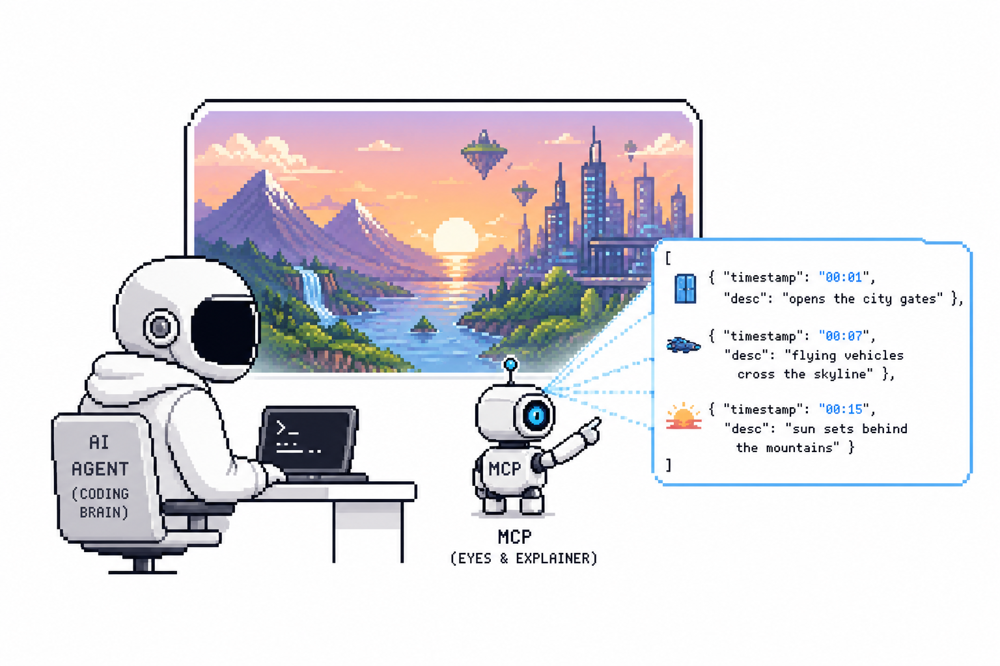

<p align="center">
  
</p>

<h1 align="center">Watch</h1>

<p align="center">
  <strong>An MCP server that gives AI coding agents eyes.</strong><br>
  Turn any screen recording into a structured timeline your agent can reason over.
</p>

<p align="center">
  <a href="#install">Install</a> ·
  <a href="#configure">Configure</a> ·
  <a href="#use">Use</a> ·
  <a href="#how-it-works">How it works</a> ·
  <a href="#roadmap">Roadmap</a>
</p>

---

Coding agents like **Claude Code**, **Codex**, and **Cursor** reason well over text,
code, and images — but they're blind to video. Developers share bugs, demos, and
tutorials as screen recordings all the time. **Watch** bridges that gap: it analyzes a
video and returns **semantic events**, not a frame-by-frame dump, so the agent can
answer questions about what actually happened.

> AI coding agents already have the brain. **Watch gives them eyes.**

```
Video  →  Watch  →  Structured observations  →  Claude Code  →  Reasoning
```

## What you get

A compact, structured timeline instead of thousands of tokens of frame descriptions:

```json
{
  "duration": "02:13",
  "events": [
    { "timestamp": "00:05", "type": "navigation",  "description": "Developer opens localhost:3000" },
    { "timestamp": "00:18", "type": "interaction", "description": "Clicks the Submit button" },
    { "timestamp": "00:22", "type": "error",       "description": "Console displays HTTP 500" }
  ]
}
```

Event `type` is one of `navigation`, `interaction`, `error`, `ui_change`, `terminal`,
`network`, `loading`, `dialog`, `code_edit`, `other`.

## Features

- 🎥 **Local files** — `.mp4`, `.mov`, `.webm`, `.mkv`, `.avi`, `.m4v`
- 🔗 **Hosted URLs** — Loom, ScreenPal, Vimeo (public), direct MP4 (downloaded to a temp file, deleted after analysis)
- 🧠 **Model-agnostic** — any OpenAI-compatible vision endpoint (local vLLM Qwen2.5-VL, DashScope, OpenRouter, …)
- ✂️ **Scene-aware sampling** — only meaningful moments are sent to the model, keeping output and token cost small
- 🔌 **One tool** — `watch_video`, over stdio, works with any MCP client

## Install

**Requirements:** Python 3.11+ and [FFmpeg](https://ffmpeg.org/) (decodes video, merges Loom/ScreenPal streams).

```bash
# 1. FFmpeg
winget install Gyan.FFmpeg          # Windows  (macOS: brew install ffmpeg · Linux: apt install ffmpeg)

# 2. Clone & install
git clone https://github.com/<you>/watch.git
cd watch
python -m venv .venv
# Windows: .\.venv\Scripts\Activate.ps1   ·   macOS/Linux: source .venv/bin/activate
pip install -e ".[dev]"

# 3. Configure
cp .env.example .env                # then edit (or leave WATCH_VLM_MODEL=stub to try offline)
```

## Configure

Watch talks to any **OpenAI-compatible vision endpoint**. Set these in `.env`:

| Variable | Description |
| --- | --- |
| `WATCH_VLM_BASE_URL` | e.g. `http://localhost:8000/v1` (local vLLM) or a hosted compat endpoint |
| `WATCH_VLM_MODEL` | e.g. `Qwen/Qwen2.5-VL-7B-Instruct`. Set to `stub` for an offline, no-key dry run |
| `WATCH_VLM_API_KEY` | Bearer token, if your endpoint requires one |

Optional tuning: `WATCH_VLM_MAX_TOKENS`, `WATCH_MAX_FRAMES`, `WATCH_FRAME_MAX_EDGE`, `WATCH_SCENE_THRESHOLD`, `WATCH_FALLBACK_INTERVAL`, `WATCH_MAX_DURATION`.

## Use

Watch runs as a stdio MCP server (`python -m watch_mcp.server`), so any MCP-capable
agent can use it. Register it with your client below, then just share a recording:

```
Why is my React modal closing?
[bug.mp4]
```

The agent calls `watch_video(path="bug.mp4", prompt="Why is my React modal closing?")`
and reasons over the returned timeline.

> Use the **absolute path** to `python` from your virtualenv (e.g.
> `.venv/Scripts/python.exe` on Windows, `.venv/bin/python` on macOS/Linux) so the
> server starts with the right dependencies, regardless of the client's working directory.

### Claude Code

```bash
claude mcp add watch -- /path/to/.venv/bin/python -m watch_mcp.server
```

### Cursor

Add to `.cursor/mcp.json` (project) or `~/.cursor/mcp.json` (global):

```json
{
  "mcpServers": {
    "watch": {
      "command": "/path/to/.venv/bin/python",
      "args": ["-m", "watch_mcp.server"]
    }
  }
}
```

Then enable **watch** under *Settings → MCP*.

### Codex

Add to `~/.codex/config.toml`:

```toml
[mcp_servers.watch]
command = "/path/to/.venv/bin/python"
args = ["-m", "watch_mcp.server"]
```

Or register it in one line:

```bash
codex mcp add watch -- /path/to/.venv/bin/python -m watch_mcp.server
```

**Example use cases:** bug reproduction, implementing a UI shown in a demo, extracting
steps from a tutorial, and generating QA repro steps from a recording.

## How it works

```
input (path | url)
  → resolve            local file, or yt-dlp download to a temp file
  → scene detection    PySceneDetect finds meaningful cut points
  → frame sampling     one keyframe per scene (interval fallback for static clips)
  → downscale          Pillow, longest edge ~768px
  → VLM                batched frames + prompt → strict timeline JSON
  → validate           parsed into a typed model (one repair retry on bad JSON)
```

## Develop

```bash
pytest                    # unit tests, plus an end-to-end stub run when ffmpeg is present
python -m watch_mcp.server    # start the stdio MCP server directly
```

## Roadmap

| Phase | Scope |
| --- | --- |
| **1** ✅ | Local files, Loom/ScreenPal URLs, structured timeline output |
| **2** | OCR, audio transcription, terminal/browser understanding, in-video search |
| **3** | Live screen sharing, continuous real-time observations streamed to the agent |

## License

MIT — see [`LICENSE`](LICENSE).
