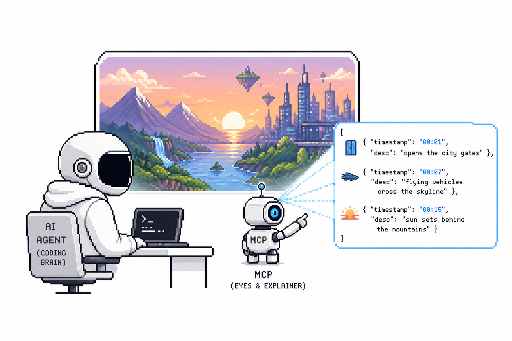

<p align="center">
  
</p>

<h1 align="center">Watch</h1>

<p align="center">
  <strong>An MCP server that gives AI coding agents eyes.</strong><br>
  Turn any screen recording into a structured timeline your agent can reason over.
</p>

<p align="center">
  <a href="#install">Install</a> ·
  <a href="#configure">Configure</a> ·
  <a href="#use">Use</a> ·
  <a href="#how-it-works">How it works</a> ·
  <a href="#roadmap">Roadmap</a>
</p>

---

Coding agents like **Claude Code**, **Codex**, and **Cursor** reason well over text,
code, and images — but they're blind to video. Developers share bugs, demos, and
tutorials as screen recordings all the time. **Watch** bridges that gap: it analyzes a
video and returns **semantic events**, not a frame-by-frame dump, so the agent can
answer questions about what actually happened.

> AI coding agents already have the brain. **Watch gives them eyes.**

```
Video  →  Watch  →  Structured observations  →  Claude Code  →  Reasoning
```

## What you get

A compact, structured timeline instead of thousands of tokens of frame descriptions:

```json
{
  "video_id": "a3f8c1d29b4e07f5",
  "duration": "02:13",
  "events": [
    { "timestamp": "00:05", "type": "navigation",  "description": "Developer opens localhost:3000" },
    { "timestamp": "00:18", "type": "interaction", "description": "Clicks the Submit button" },
    { "timestamp": "00:22", "type": "error",       "description": "Console displays HTTP 500" }
  ],
  "cost": { "usd": 0.000097, "prompt_tokens": 416, "completion_tokens": 128, "model": "qwen/qwen3-vl-32b-instruct", "calls": 1 }
}
```

`cost` reports real usage from the endpoint (via OpenRouter usage accounting); it's
`null` for `mode="manual"` and `get_frames` since those make no model call.

Event `type` is one of `navigation`, `interaction`, `error`, `ui_change`, `terminal`,
`network`, `loading`, `dialog`, `code_edit`, `other`.

## Tools

**`watch(video_path, query=None, mode="sample", start=None, end=None)`** — analyze a
video, return the timeline above plus a `video_id`. Modes:

| mode | what it does | cost |
| --- | --- | --- |
| `sample` (default) | AI scans scene-sampled frames → timeline | cheap, flat |
| `manual` | no AI — just cache the video, return `video_id` + `duration` so the agent inspects frames itself | zero |
| `full` | send the whole clip to a video-native model (`start`/`end` trims it first) | scales with duration |

`full` needs a **video-capable** endpoint. On OpenRouter that means e.g.
`qwen/qwen3.5-*`, `qwen/qwen3.6-*`, or `xiaomi/mimo-v2.5` — the `qwen2.5-vl` /
`qwen3-vl` series are image-only and only work with `sample`.

**`get_frames(video_id, start, end=None, max_frames=8)`** — pull the actual frame
images from a video you already watched. The agent's own eyes, for when it doubts
the timeline or the user pointed at an exact moment. Backed by a content-addressed
cache, so no re-download.

## Features

- 🎥 **Local files** — `.mp4`, `.mov`, `.webm`, `.mkv`, `.avi`, `.m4v`
- 🔗 **Hosted URLs** — Loom, ScreenPal, Vimeo (public), direct MP4
- 🧠 **Model-agnostic** — any OpenAI-compatible vision endpoint (local vLLM Qwen2.5-VL, DashScope, OpenRouter, …)
- ✂️ **Scene-aware sampling** — only meaningful moments go to the model, keeping output and token cost small
- 👁️ **On-demand frames** — `get_frames` lets the agent look at exact pixels when the summary isn't enough
- 🗄️ **Content-addressed cache** — repeat watches and frame pulls reuse the resolved video; survives restarts
- 💰 **Per-call cost tracking** — every `watch` result reports real USD + token usage for the model call(s)
- 🔌 **Stdio MCP** — works with any MCP client

## Quick start

**One command.** No manual FFmpeg, no venv, no config files, no per-client setup.
Requires only [`uv`](https://docs.astral.sh/uv/) (or `pipx`) and Python 3.11+.

```bash
uvx --from git+https://github.com/ManzarAli25/watch-it watch-mcp setup
```

The `setup` wizard:

1. asks for your API key and models (defaults to OpenRouter),
2. writes the config to a per-user location, and
3. auto-registers Watch with every MCP client it finds (Claude Code, Cursor, Codex).

FFmpeg ships with the package — nothing to install. Then verify:

```bash
uvx --from git+https://github.com/ManzarAli25/watch-it watch-mcp doctor
```

Once published to PyPI this shortens to `uvx watch-mcp setup` /
`pipx install watch-mcp && watch-mcp setup`.

### CLI

| Command | Does |
| --- | --- |
| `watch-mcp setup` | Interactive config + client registration |
| `watch-mcp ui` | Terminal UI for config + client registration |
| `watch-mcp doctor` | Check FFmpeg, config, and client registration |
| `watch-mcp serve` | Run the MCP server over stdio (clients launch this) |
| `watch-mcp watch <path\|url> --mode full` | Analyze one video from the terminal |

### Configure

Watch talks to any **OpenAI-compatible vision endpoint**. `setup` writes these; you
can also set them as `WATCH_`-prefixed environment variables:

| Variable | Description |
| --- | --- |
| `WATCH_VLM_BASE_URL` | e.g. `https://openrouter.ai/api/v1` or `http://localhost:8000/v1` |
| `WATCH_VLM_MODEL` | Sample-mode (image) model, e.g. `qwen/qwen3-vl-32b-instruct`. `stub` = offline dry run |
| `WATCH_FULL_MODEL` | Full-mode (video) model, e.g. `qwen/qwen3.6-flash` (falls back to `WATCH_VLM_MODEL`) |
| `WATCH_VLM_API_KEY` | Bearer token, if the endpoint needs one |

Optional tuning: `WATCH_VLM_MAX_TOKENS`, `WATCH_MAX_FRAMES`, `WATCH_FRAME_MAX_EDGE`,
`WATCH_SCENE_THRESHOLD`, `WATCH_FALLBACK_INTERVAL`, `WATCH_MAX_DURATION`,
`WATCH_GET_FRAMES_MAX`, `WATCH_CACHE_TTL`, `WATCH_CACHE_MAX_BYTES`.

## Use

After `setup`, just share a recording with your agent:

```
Why is my React modal closing?
[bug.mp4]
```

The agent calls `watch(video_path="bug.mp4", query="Why is my React modal closing?")`,
reasons over the returned timeline, and can `get_frames(video_id, "00:22")` to see any
moment for itself.

<details>
<summary>Manual client registration (if you skip <code>setup</code>)</summary>

Each entry runs the `watch-mcp serve` command that lands on your PATH after install.

- **Claude Code:** `claude mcp add watch-it -- watch-mcp serve`
- **Cursor** — `~/.cursor/mcp.json`:
  ```json
  { "mcpServers": { "watch-it": { "command": "watch-mcp", "args": ["serve"] } } }
  ```
- **Codex** — `~/.codex/config.toml`:
  ```toml
  [mcp_servers.watch-it]
  command = "watch-mcp"
  args = ["serve"]
  ```
</details>

<details>
<summary>Develop from source</summary>

```bash
git clone https://github.com/ManzarAli25/watch-it.git
cd watch-it
python -m venv .venv && . .venv/bin/activate   # Windows: .\.venv\Scripts\Activate.ps1
pip install -e ".[dev]"
pytest
```
</details>

**Example use cases:** bug reproduction, implementing a UI shown in a demo, extracting
steps from a tutorial, and generating QA repro steps from a recording.

## How it works

```
watch(video_path, mode="sample")
  → resolve + cache    local file (referenced) or yt-dlp download (copied); content-addressed video_id
  → scene detection    PySceneDetect finds meaningful cut points
  → frame sampling     one keyframe per scene (interval fallback for static clips)
  → downscale          Pillow, longest edge ~768px
  → VLM                batched frames + query → strict timeline JSON
  → validate           parsed into a typed model (one repair retry on bad JSON)

get_frames(video_id, start, end)
  → cache lookup       reuse the resolved video (no re-download)
  → grab + downscale   evenly-spaced frames in [start, end], returned as images
```

`mode="manual"` stops after resolve+cache — no VLM — so the agent can drive
entirely through `get_frames`.

## Develop

```bash
pytest                    # unit tests, plus an end-to-end stub run when ffmpeg is present
python -m watch_mcp.server    # start the stdio MCP server directly
```

## License

MIT — see [`LICENSE`](LICENSE).
